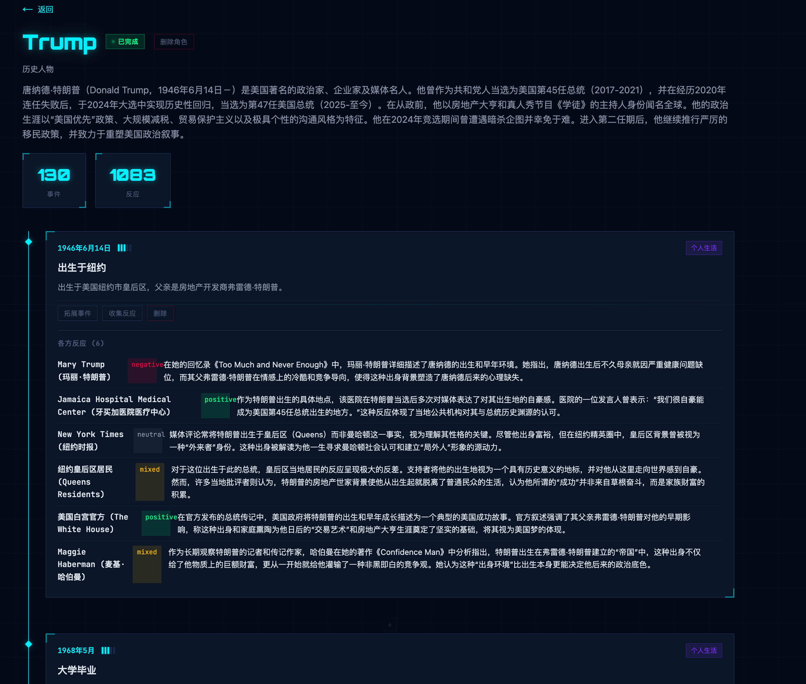

# 神探 (ShenTan)

**AI 驱动的角色生平事迹与事件反应自动收集系统**

[English](./README_EN.md) | 简体中文

输入角色名称，系统通过多个协作 AI Agent 自动搜索、爬取网页内容，提取角色的生平事件，收集各方对这些事件的反应，最终生成结构化的角色时间线数据。支持历史人物和虚构角色。



## 功能特性

- **四阶段智能收集** — 编排器调度 Biographer → EventExplorer → StatementCollector → ReactionCollector 四类 Agent 分阶段采集
- **动态质量收敛** — 事件拓展采用动态质量评估，达到阈值自动停止，避免无效迭代
- **多搜索引擎** — 支持 DuckDuckGo 和 SearXNG，具备多种搜索模式（通用、深度、广泛、新闻、社交媒体）
- **智能别名解析** — 自动搜索并解析角色别名，用户也可自定义补充
- **实时进度追踪** — Web 端通过 SSE (Server-Sent Events) 实时推送 Agent 日志和阶段进度
- **交互式时间线** — 可在任意事件间隔插入搜索、对单个事件拓展或收集反应
- **多 AI Provider** — 支持 Anthropic Claude、OpenAI 及其兼容接口（DeepSeek、Ollama 等）
- **双界面** — CLI 命令行 + Web 可视化界面，同一套核心引擎

## 技术架构

```
用户输入角色名 → Orchestrator (编排器)
  ├→ Biographer Agent        → 搜索 + 爬取 → 提取事件 → 存入 DB
  ├→ EventExplorer Agent     → 搜索 + 爬取 → 补充事件 → 存入 DB  (N 轮, 动态收敛)
  ├→ StatementCollector Agent → 搜索 + 爬取 → 收集言论/政策 → 存入 DB
  └→ ReactionCollector Agent → 搜索 + 爬取 → 提取反应 → 存入 DB
→ 输出结构化角色数据 (JSON / Markdown / Web 可视化)
```

| 层级 | 技术 | 说明 |
|------|------|------|
| AI 引擎 | Vercel AI SDK + Zod | 工具调用循环，支持多 Provider |
| 爬虫引擎 | Playwright (Chromium) | 无头浏览器爬取 + 内容提取 |
| 数据库 | SQLite (libsql / better-sqlite3) | Drizzle ORM，双驱动架构 |
| Web 框架 | Next.js 15 (App Router, React 19) | 服务端渲染 + SSE 实时日志 |
| CLI 框架 | Commander.js | 命令行入口 |
| 构建体系 | pnpm Monorepo + TypeScript (ESM) | workspace 协议包间引用 |

## 快速开始

### 环境要求

- Node.js >= 20.0.0
- pnpm
- Playwright 浏览器（首次使用需安装）
- AI Provider API Key（Anthropic / OpenAI / 兼容服务）

### 安装

```bash
# 克隆项目
git clone <repository-url>
cd shentan

# 安装依赖
pnpm install

# 安装 Playwright 浏览器
npx playwright install chromium
```

### 配置

所有配置通过 `.env` 文件统一管理。复制并编辑环境变量文件：

```bash
cp .env.example .env
```

编辑 `.env`，配置 AI Provider：

```bash
# 默认使用的 Provider
PROVIDER_DEFAULT=anthropic

# Provider: Anthropic Claude
PROVIDER_ANTHROPIC_TYPE=anthropic
PROVIDER_ANTHROPIC_MODEL=claude-sonnet-4-5-20250929
ANTHROPIC_API_KEY=sk-xxx

# Provider: OpenAI（可选）
# PROVIDER_OPENAI_TYPE=openai
# PROVIDER_OPENAI_MODEL=gpt-4o
# OPENAI_API_KEY=sk-xxx

# Provider: OpenAI 兼容接口（DeepSeek / Ollama 等，可选）
# PROVIDER_CUSTOM_TYPE=openai-compatible
# PROVIDER_CUSTOM_MODEL=your-model
# PROVIDER_CUSTOM_BASE_URL=https://your-api-endpoint/v1
# PROVIDER_CUSTOM_API_KEY=sk-xxx
```

## 使用指南

### CLI 命令行

```bash
# 收集角色事迹
pnpm cli collect <角色名>

# 指定角色类型和来源
pnpm cli collect 特朗普 -t historical
pnpm cli collect 哈利波特 -t fictional -s "哈利波特系列"

# 自定义别名和拓展轮次
pnpm cli collect 曹操 -a "曹孟德,魏武帝" -r 8

# 导出角色数据
pnpm cli export <角色名或ID> -f json -o ./output
pnpm cli export <角色名或ID> -f markdown -o ./output

# 删除数据
pnpm cli delete character <角色名或ID>
pnpm cli delete event <事件ID>
pnpm cli delete reaction <反应ID>

# 启动 Web 界面
pnpm cli serve -p 3000
```

**CLI 选项说明：**

| 选项 | 说明 | 默认值 |
|------|------|--------|
| `-t, --type` | 角色类型：`historical`（历史人物）或 `fictional`（虚构角色） | `historical` |
| `-s, --source` | 角色来源（如"哈利波特系列"） | — |
| `-r, --rounds` | 事件拓展最大轮次（动态收敛，实际可能更少） | `5` |
| `-a, --aliases` | 用户自定义别名，逗号分隔 | — |
| `--db` | 数据库文件路径 | `./data/shentan.db` |

### Web 界面

```bash
# 启动 Web 开发服务器
pnpm web
```

浏览器访问 `http://localhost:3000`，即可使用可视化界面：

1. **首页** — 查看所有已收集的角色列表
2. **收集页面** — 填写角色信息，实时查看 Agent 运行日志
3. **角色详情** — 浏览时间线、事件、各方反应
4. **交互操作** — 在时间线中间插入搜索、收集单个事件的反应

### 导出格式

**JSON 格式**：包含完整的角色数据、事件列表和反应信息。

**Markdown 格式**：生成带时间线的事件文档，包含：
- 分类标签（个人生活、职业生涯、政治活动等）
- 重要度星级
- 各方反应（含情感倾向标注）

## 项目结构

```
shentan/
├── apps/
│   ├── cli/                    # 命令行应用 (@shentan/cli)
│   │   └── src/
│   │       ├── index.ts        # Commander.js 命令注册
│   │       └── commands/       # collect / export / delete / serve
│   └── web/                    # Web 可视化应用 (@shentan/web)
│       └── src/
│           ├── app/            # Next.js App Router 页面和 API 路由
│           ├── components/     # React 组件
│           └── lib/            # 数据访问层和任务管理
├── packages/
│   ├── core/                   # 核心数据层 (@shentan/core)
│   │   └── src/db/             # Drizzle Schema、连接管理、查询函数
│   ├── crawler/                # 爬虫引擎 (@shentan/crawler)
│   │   └── src/                # Playwright 浏览器、搜索、内容提取
│   └── agents/                 # AI Agent (@shentan/agents)
│       └── src/
│           ├── orchestrator.ts       # 编排器：调度各 Agent
│           ├── biographer.ts         # 生平采集 Agent
│           ├── event-explorer.ts     # 事件拓展 Agent
│           ├── statement-collector.ts # 言论收集 Agent
│           ├── reaction-collector.ts # 反应收集 Agent
│           ├── alias-resolver.ts     # 别名解析
│           ├── quality-assessor.ts   # 质量评估与收敛控制
│           ├── tools/                # Agent 工具定义 (Zod Schema)
│           ├── prompts/              # 系统提示词
│           ├── provider/             # AI Provider 工厂
│           └── config/               # 环境变量配置加载
├── scripts/
│   ├── agent-runner.ts         # Web 端单任务子进程入口
│   └── task-runner.ts          # Web 端完整收集子进程入口
├── .env                        # 环境变量配置
├── pnpm-workspace.yaml         # Monorepo 工作区配置
└── tsconfig.base.json          # TypeScript 基础配置
```

## 开发指南

### 常用命令

```bash
pnpm install          # 安装依赖
pnpm build            # 构建所有包
pnpm dev              # 开发模式运行 CLI
pnpm web              # 启动 Web 开发服务器
pnpm db:generate      # 生成 Drizzle 迁移文件
pnpm db:migrate       # 执行数据库迁移
```

### 添加新 Agent

1. 在 `packages/agents/src/` 创建 Agent 文件
2. 在 `packages/agents/src/prompts/` 添加系统提示词
3. 在 `packages/agents/src/tools/` 注册工具（Zod Schema 校验入参）
4. 在 `orchestrator.ts` 中编排新 Agent 的执行顺序

### 环境变量

所有配置通过 `.env` 文件统一管理，无需额外配置文件。

#### 核心设置

| 变量 | 说明 | 默认值 |
|------|------|--------|
| `PROVIDER_DEFAULT` | 默认使用的 Provider 名称 | 第一个定义的 Provider |
| `MAX_TOKENS` | 全局 AI 最大输出 Token | `8000` |
| `DATABASE_PATH` | SQLite 数据库路径 | `./data/shentan.db` |
| `PORT` | Web 服务端口 | `3000` |

#### Provider 定义

通过 `PROVIDER_<名称>_*` 前缀定义 AI Provider（自动发现机制）：

| 变量模式 | 说明 | 必填 |
|---------|------|------|
| `PROVIDER_<名称>_TYPE` | Provider 类型：`anthropic` / `openai` / `openai-compatible` | 是 |
| `PROVIDER_<名称>_MODEL` | 模型名称 | 是 |
| `PROVIDER_<名称>_API_KEY` | API 密钥（也可用 `<名称>_API_KEY`） | 否 |
| `PROVIDER_<名称>_BASE_URL` | 自定义 API 地址（`openai-compatible` 必填） | 否 |

#### 搜索引擎

| 变量 | 说明 | 默认值 |
|------|------|--------|
| `SEARXNG_BASE_URL` | SearXNG 服务地址 | (不启用) |
| `SEARXNG_ENABLED` | 是否启用 | `true` |
| `SEARXNG_CACHE_TTL` | 缓存 TTL（秒） | `1800` |

#### Agent 覆盖（可选）

| 变量模式 | 说明 | 默认值 |
|---------|------|--------|
| `AGENT_<名称>_MAX_ITERATIONS` | 最大迭代次数 | `25` |
| `AGENT_<名称>_MAX_TOKENS` | 最大输出 Token | 继承全局 `MAX_TOKENS` |

Agent 名称：`BIOGRAPHER` / `EVENT_EXPLORER` / `STATEMENT_COLLECTOR` / `REACTION_COLLECTOR`

#### 质量控制（可选）

| 变量 | 说明 | 默认值 |
|------|------|--------|
| `QUALITY_MAX_EXPLORE_ROUNDS` | 最大拓展轮次 | `5` |
| `QUALITY_MIN_EXPLORE_ROUNDS` | 最小拓展轮次 | `2` |
| `QUALITY_CONVERGENCE_THRESHOLD` | 收敛阈值 | `2` |
| `QUALITY_CONSECUTIVE_DRY_ROUNDS` | 连续无效轮次 | `2` |

### 编码规范

- TypeScript strict mode，ESM 模块体系
- 相对导入使用 `.js` 后缀（ESM 兼容）
- 表名和列名使用 snake_case，ORM 映射为 camelCase
- Web 应用：App Router，服务端组件优先

## 许可证

MIT
